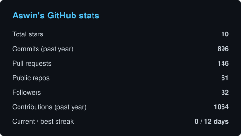
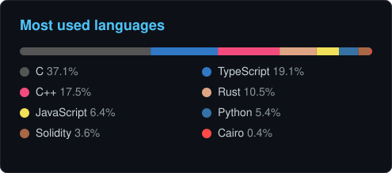

<div align="center">


<a href="https://www.linkedin.com/in/aswin-kumar-7399971b3/"></a>
<a href="https://twitter.com/ash20pk"></a>
<a href="mailto:ash20pk@gmail.com"></a>


<br/>


</div>

## 👋 Hey, I'm Ash

I lead Forward Deployed Engineering at **[OpenBox AI](https://github.com/openbox-ai)**. Basically I sit between our customers and the product, take whatever messy problem they bring, and turn it into an AI system that actually works. Usually faster than anyone expects.

Before agents took over my life, I spent years deep in web3. Smart contracts, DeFi protocols, ZK demos, and a lot of developer education across EVM, Move, CosmWasm, Cairo and Sui. That's where I picked up the habits I still build with today: secure by default, permissioned by design, and a bit obsessed with developer experience.

```ts
const ash = {
  role:    "FDE Lead at OpenBox AI",
  focus:   ["AI agent infrastructure", "governed and permissioned agents", "RAG and knowledge graphs"],
  roots:   ["DeFi", "tokenization", "ZK", "multi-chain dApps"],
  motto:   "prototype on Monday, production by Friday",
  openTo:  ["agent runtimes", "web3 x AI", "devtools", "NLP"],
};
```

## 🧰 What I work with

<table>
<tr>
<td width="50%" valign="top">

**🤖 AI and Agents**


Agent runtimes and sandboxes, policy-governed agents, conversational RAG, knowledge-graph embeddings of SDKs, and quick AI product prototypes

</td>
<td width="50%" valign="top">

**⛓️ Blockchain and Smart Contracts**


DeFi and lending protocols, ERC-404 fractionalized NFTs, tokenization, on-chain games, ZK demos, and stress-testing chains for fun

</td>
</tr>
<tr>
<td width="50%" valign="top">

**🖥️ Full-Stack**


</td>
<td width="50%" valign="top">

**🌐 Chains I've shipped on**


</td>
</tr>
</table>

## 🚀 Stuff I'm proud of

| Project | What it does | Stack |
|---|---|---|
| **[BerthOS](https://github.com/Ash20pk/BerthOS)** | A persistent, kernel-permissioned sandbox for AI agents. Real filesystem, browser and shell, not a bag of stateless API calls | `TypeScript` |
| **[eleven-governed-agent](https://github.com/Ash20pk/eleven-governed-agent)** | An AI agent with policies and guardrails that are actually enforced, not just prompted | `Python` |
| **[SDKAnalyzer](https://github.com/Ash20pk/SDKAnalyzer)** | Points an LLM at any SDK and builds knowledge-graph embeddings out of it | `Python` |
| **[nftmarketplace](https://github.com/Ash20pk/nftmarketplace)** ⭐ | Fractionalized NFT marketplace built on ERC-404 | `Solidity` |
| **[Enigma](https://github.com/Ash20pk/Enigma)** | A DeFi protocol built on top of 1inch APIs | `TypeScript` |
| **[nexus-playground](https://github.com/Ash20pk/nexus-playground)** | Visual composer studio for the Avail Nexus SDK | `TypeScript` |
| **[aptos-asset-template](https://github.com/Ash20pk/aptos-asset-template)** | Fungible and non-fungible asset implementation on Aptos | `Move` |
| **[breaksomnia](https://github.com/Ash20pk/breaksomnia)** | A chain-reaction simulator that posts every explosion on-chain to stress test Somnia live | `TypeScript` |
| **[Interactive-ZK-demo](https://github.com/Ash20pk/Interactive-ZK-demo)** | Learn zero-knowledge concepts visually instead of through 40 pages of math | `Python` |

<details>
<summary><b>More builds</b> (games, education templates and random experiments)</summary>
<br/>

- 🎮 **On-chain games** [flappy-bird](https://github.com/Ash20pk/flappy-bird), [breakchain](https://github.com/Ash20pk/breakchain) (the dino game as a chain stress test), [CardGame](https://github.com/Ash20pk/CardGame) (1v1 Phaser game on Core), [sherlock_game](https://github.com/Ash20pk/sherlock_game)
- 📚 **Developer education templates** [Blockstay-dApp](https://github.com/Ash20pk/Blockstay-dApp) (Fuel), [ticketing-blended-app](https://github.com/Ash20pk/ticketing-blended-app) (Fluent, Rust + Solidity), [lending-dApp-mantra](https://github.com/Ash20pk/lending-dApp-mantra), [Calculator-dApp](https://github.com/Ash20pk/Calculator-dApp) (Aptos Move), [Loyalty-dApp](https://github.com/Ash20pk/Loyalty-dApp) (Sui), [erc20-starknet-cairo-boilerplate](https://github.com/Ash20pk/erc20-starknet-cairo-boilerplate)
- 🧠 **AI apps** [conversational_rag](https://github.com/Ash20pk/conversational_rag), [resume-builder-ai](https://github.com/Ash20pk/resume-builder-ai), [ai-image-editor](https://github.com/Ash20pk/ai-image-editor), [sentimental_analysis](https://github.com/Ash20pk/sentimental_analysis) (blind compute on Nillion)
- 🔐 **ZK and privacy** [Rock-Paper-Scissor-ZK](https://github.com/Ash20pk/Rock-Paper-Scissor-ZK), [privado-poc](https://github.com/Ash20pk/privado-poc)

</details>

## 📊 GitHub stats

<div align="center">


</div>

## 🤝 Let's build something

Always up for collaborating on agent runtimes, web3 x AI, or developer tooling. When I'm not at the keyboard I'm travelling, meeting new people, and talking about random stuff. Bonus points if you love tech or finance.

<div align="center">

📫 **ash20pk@gmail.com** · [LinkedIn](https://www.linkedin.com/in/aswin-kumar-7399971b3/) · [X](https://twitter.com/ash20pk)


</div>
